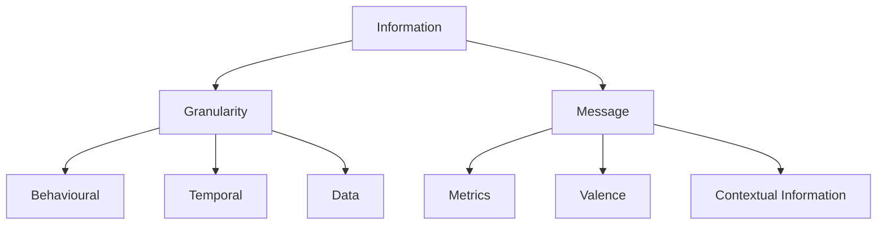
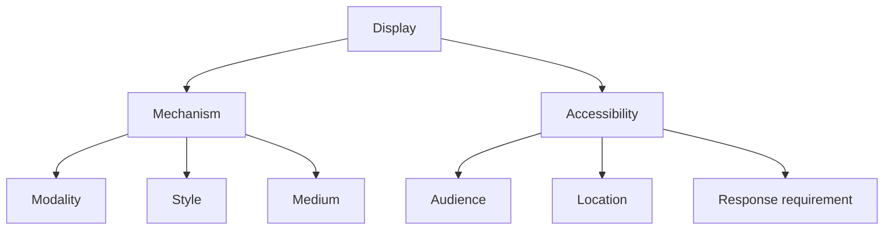
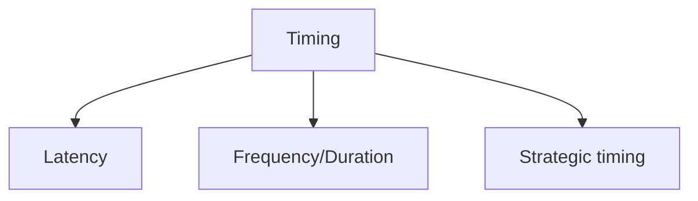

# Eco-feedback classification
See this [article](https://cloud.univ-grenoble-alpes.fr/s/2Bm5iiQrwyW7GNf?dir=undefined&path=%2FPrincipes%20de%20l%27%C3%A9co-feedback&openfile=497438896)

>**Eco-feedback** is information about resource (energy, water, food) consumption provided back to consumer(s)  with the *goal* of promoting more *sustainable* behavior.

>**Effective** eco-feedback relies upon an understanding of  *key eco-feedback design* dimensions and how they relate to *behavior change*. 

According to this [paper](https://cloud.univ-grenoble-alpes.fr/s/2Bm5iiQrwyW7GNf?dir=undefined&path=%2FPrincipes%20de%20l%27%C3%A9co-feedback&openfile=497438896), eco-feedback can be effective on this three **general behavioral mechanisms** :
	 - Attention
	 - Learning
	 - Motivation

<table>

	<tr>
		<th scope="col", colspan=2>Information</th>
		<th scope="col", colspan=2>Display</th>
		<th scope="col">Timing</th>
	</tr>

	<tr>
		<th scope="col">Granularity</th>
		<th scope="col">Message</th>
		
		<th scope="col">Mechanism</th>
		<th scope="col">Accessibility</th>
		
		<th scope="col"></th>
	</tr>
	
	<tr>
		<td scope="col">Behavioural</td>
		<td scope="col">Metrics</td>
		
		<td scope="col">Modality</td>
		<td scope="col">Audience</td>
		
		<td scope="col">Latency</td>
	</tr>
	
	<tr>
		<td scope="col">Temporal</td>
		<td scope="col">Valence</td>
		
		<td scope="col">Style</td>
		<td scope="col">Location</td>
		
		<td scope="col">Frequency/Duration</td>
	</tr>

	<tr>
		<td scope="col">Data</td>
		<td scope="col">Contextual Information</td>
		
		<td scope="col">Medium</td>
		<td scope="col">Response requirement</td>
		
		<td scope="col">Strategic timing</td>
	</tr>

</table>

## Information

### Granularity

#### Behavioural granularity
#### Temporal granularity
#### Data granularity

### Message

#### Metrics
#### Valence
####  Contextual Information

## Display

### Mechanism

#### Modality
#### Style
####  Medium

### Accessibility

#### Audience
#### Location
####  Response requirement

## Timing

#### Latency
#### Frequency/Duration
####  Strategic timing

